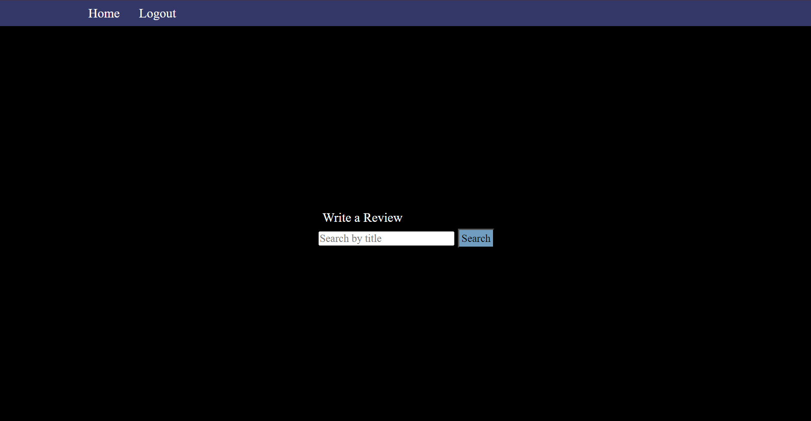
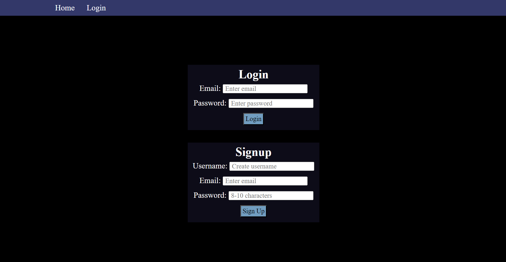
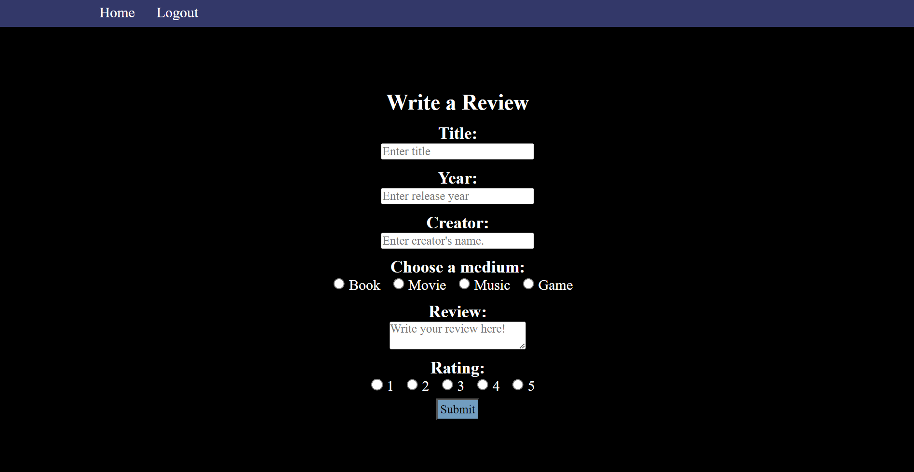
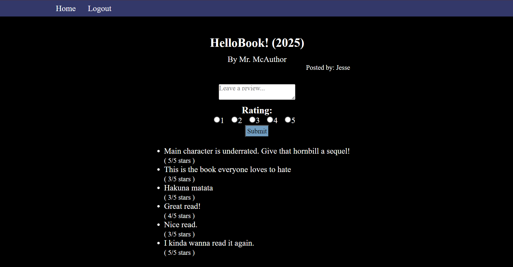

<div align='center'>
  
# Pop Culture Critique

[](https://opensource.org/licenses/MIT)

</div>

## Description

There are many independent platforms dedicated to providing reviews for various restaurants, products, and locations. However, there aren’t many independent platforms dedicated to reviews on books, music, and movies. This project aims to provide a platform to read/write reviews regarding books, music, and movies that aren’t cherry-picked by certain parties or limited only to a certain population. Moreover, this project aims to connect related media together in hopes of providing the user a more holistic approach to reviewing pieces of media.

## Usage

To open the webpage, click this link here to go directly!

[Pop Culture Critique](https://pop-culture-critic.onrender.com/)

_OR_ Copy this link to paste it into a browser.

```md
https://pop-culture-critic.onrender.com/
```



The above page will be the starting homepage. The nav bar at the top contains the buttons for returning home and logging in/logging out (depending on your login status).



If you are not logged in and wish to log in, press the Login in button to progress to the login screen where you will be prompted to enter information to either log in or sign up.



If you are already logged in and wish to write a review instead, clicking on 'Write a Review' will lead you to the review form. It will either add your review to an item that matches the title inputted, or create a new item and attach the review there if that title doesn't exist in our database.



When you search for a title or submitting a review form, you will be taken to a page that displays information related to the item, and any existing reviews will be listed underneath. However, you must be logged in to view this page. Here, there is another form to write a review.

## Credits

Collaborators:

- [tjbush-123](https://github.com/tjbush-123)
- [jesse437](https://github.com/jesse437)
- [davehyler](https://github.com/davehyler)
- [geovko](https://github.com/geovko)
- [robscafe433](https://github.com/robscafe433)

Third-Party API(s):

- [Open Library](https://openlibrary.org/)

NPM Packages Used:

- Node.js
- Express.js
- PostgreSQL

## License

MIT License
